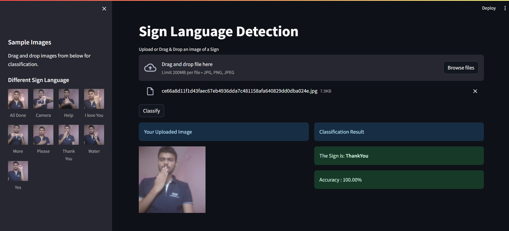

# Sign Quality Detector

## Overview
Sign Quality Detector is a web application that uses a machine learning model to classify Signs as either **Good** or **Spoiled**. This project demonstrates how TensorFlow and Keras can be used to build and deploy a Sign classification system on Streamlit.




## Hosted App
The application is live and hosted at:
[https://Sign-classify.onrender.com/](https://Sign-classify.onrender.com/)

## Key Learning
To successfully deploy this app on Streamlit, use TensorFlow and Keras version **2.15.0**.

## Features
- Upload an image of a Sign to classify its quality.
- Sidebar with sample images of both good and spoiled Signs.
- Intuitive and responsive user interface built using Streamlit.

## Tech Stack
- **Frontend**: Streamlit
- **Backend**: TensorFlow, Keras
- **Languages**: Python

## Installation Guide
Follow the steps below to run the project locally:

1. Clone the repository:
   ```bash
   git clone [https://github.com/SimpleCyber/Sign_Classification- .git](https://github.com/SimpleCyber/Sign-Language-Detection.git)
   ```
2. Navigate to the project directory:
   ```bash
   cd Sign_Classification- 
   ```
3. Install the required dependencies:
   ```bash
   pip install -r requirements.txt
   ```
4. Run the Streamlit app:
   ```bash
   streamlit run app.py
   ```

## Contribution
We welcome contributions! If you’re interested, please visit the GitHub repository:
[[https://github.com/SimpleCyber/Sign_Classification- .git](https://github.com/SimpleCyber/Sign-Language-Detection.git)]

## License
This project is licensed under the MIT License. See the [LICENSE](LICENSE) file for details.

---

✨ **Enjoy detecting Sign quality with ease!**

